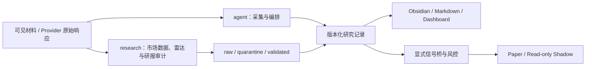

# Quant Strategy Workspace

这是一个面向真实资金决策、但严格停留在研究、Paper 与人工复核边界内的中低频量化策略工作区。默认模型是可解释的 OLS、Ridge 和 Fama–MacBeth，不以复杂度代替证据，也不承诺盈利。仓库永久不支持 LIVE 下单。

## 当前唯一默认主线

```text
A股中证800动态PIT股票池
  -> 六个冻结质量成长因子（首披财务）
  -> 同日去极值 / 行业与风格残差化 / Z-score
  -> Fama–MacBeth + Newey–West / train-only Ridge alpha=1
  -> D+1开盘到D+21开盘的20日标签、20日调仓、Top2整手执行
  -> 账户成本 / 美的外部持仓 / 行业集中度 / 回撤与换手门
  -> 历史全门通过后12个月Paper
  -> 仅人工真实资金候选
```

主入口是 `research.strategy_workspace`，完整契约和命令见[策略工作区说明](docs/STRATEGY_WORKSPACE.md)。冻结账户成本为佣金 `0.00018`、单笔最低 `5` 元、卖出税 `0.0005`、双边过户费 `0.00001`、基础单边滑点 10 bps；压力情景为20 bps和双倍佣金。

[自适应仓位 V2](docs/ADAPTIVE_EXPOSURE_V2.md) 是独立、非默认的日频信号生产系统：P0.1执行内核保持冻结，本轮补齐Factor Discovery、train-only模型/校准、Exposure/Constructor Policy V2、Next-session Signal V2和逐日发布证据。`ExperimentV3AdmissionReceiptV1` 当前只能表达 `diagnostic_binding_only_not_formally_admitted` 的结构绑定，正式loader固定为 `blocked_not_implemented`；生产代码没有issuer token或issuer helper。正式Alpha因此固定 `DATA_FAIL_CLOSED` 且不能产生BUY，诊断打分也不能升级为正式信号。

LLM 在 [`research/factor_discovery/`](research/factor_discovery/README.md) 中只能提出 `llm_research_candidate_only` 的因子假设，不能自报验证通过或直接进入模型。Daily Pipeline仍每天写决策，但固定本地发布registry只授予 `BLOCKED` 或 `RISK_REDUCTION_ONLY`：前者写4项最小证据且不可进入D+1，后者写17项完整证据并只允许四类风险退出首次紧邻D+1。所有artifact先做canonical JSON roundtrip，日期槽create-only，`COMMITTED`最后写入；不完整槽失败关闭并要求人工恢复。该单机文件系统ACL只是本地writer权限边界，不是外部来源认证。外部受控PIT、官方日历/证券规则/行情registry和正式Experiment V3仍未接入；2024—2025 Locked Test未运行、未解释，所有Paper、交易、真实资金和LIVE准入继续关闭。质量成长V1默认入口、Top2/20%现金规则和既有账本语义保持不变。

2026-08-24最终红队又关闭三项发布阻断：正式Daily decision、Exposure decision和Alpha ranking在发布边界执行冻结JSON Schema校验；authority/status/data-status/failure/safety及Exposure state/target到Intent、Construction、Daily的条件图必须一致；Next-session从固定registry加载后独立重复整图校验。Experiment诊断receipt、Daily admission/publication/loaded对象和Next-session Signal的信任边界均要求exact type并直接调用基类校验，调用方子类不能覆写验证或序列化方法绕过失败关闭。

当前真实状态是 `blocked_missing_pit_data`，不是“策略已跑完”。2026-08-19 Choice 只读链曾完成当前800成分、当前一级行业、历史行业日期回显、中证800价格/全收益别名及60只股票价量采集；用户现已确认Choice访问权限到期，所有新网络访问在SDK导入前以`provider_access_expired`失败关闭，旧证据保留但不进入新的正式研究消费。既有降级样本覆盖2026-02-24至2026-08-18的121个共同交易日，60只均生成六个技术诊断因子；但它使用当前成分与当前行业，不是历史PIT，且相对收益使用价格指数而非正式全收益序列。当前只有单截面，没有排名、历史回测、Paper证书或股票清单。

查看当前因子目录，以及把真实探针绑定成状态产物：

```powershell
python -m research.strategy_workspace catalog

python -m research.strategy_workspace quality-status `
  --policy configs/strategy_quality_growth.v1.json `
  --daily-bar-probe data/tmp/strategy-workspace/quality-growth-v1/capability/choice_daily_bar.retry4-20260819.json `
  --trade-calendar-probe data/tmp/strategy-workspace/quality-growth-v1/capability/choice_trade_calendar.retry4-20260819.json `
  --historical-sector-probe data/tmp/strategy-workspace/quality-growth-v1/capability/choice_historical_sector.csi800-20260819.json `
  --output data/tmp/strategy-workspace/quality-growth-v1/current_status.v6.json
```

该状态命令在数据门阻塞时返回非零退出码。旧中证行业 `RM20` 2017—2023 负结果保留为历史反证和兼容测试，不再是默认策略主线，也不能通过调参复活。

## 冻结兼容区

原有 Factor Lab、研报审计、市场观察、行业雷达和合成执行内核保留为证据适配器、历史复现或安全兼容层，不再作为默认策略开发入口。它们不会被物理删除，以免破坏已有产物、测试或用户未提交改动；新功能只进入 `research/strategy_workspace/`。

## 兼容能力

| 模块 | 当前边界 |
|---|---|
| Strategy Workspace | A股质量成长六因子、Experiment v2、Choice数据门、PIT截面、线性检验、100万元Top Decile/1万元Top2成本账本和append-only Paper账本内核已实现；当前60只非PIT价量诊断已真实运行，正式质量成长PIT数据与正式回测仍未跑，Stage B因 `blocked_missing_controlled_paper_signal_adapter` 和 `blocked_missing_daily_paper_risk_marks` 保持阻塞 |
| 因子发现治理 | LLM仅能形成候选假设；独立Validation receipt与approved-factor registry负责从候选到冻结研究因子的显式升级。它们不运行Locked Test、不生成Alpha或订单，也不授予任何准入 |
| 自适应仓位 V2（非默认） | P0.1执行内核、五模块、不可变日报、固定Daily publication registry、D+1人工复核与日频账本已实现；发布前及Next加载后均复核正式Schema与跨artifact条件图，信任边界拒绝契约子类。正式Alpha因V3 loader阻断而 `DATA_FAIL_CLOSED`，当前只有零订单 `BLOCKED` 或无BUY的 `RISK_REDUCTION_ONLY` 可发布；所有准入仍关闭 |
| 市场数据 V2 | Provider Registry、BaoStock 日线/交易日历/证券基础信息、raw/quarantine/validated、离线回放和结构化探针；Choice新访问已到期失败关闭；Tushare旧轮次以`capability_probe_bug`封存，新授权链仅允许一次HTTP `trade_cal`并要求可重放终态；正式Provider仍未迁移 |
| 中证行业 Factor Lab V1 | 引擎、Provider、固定 `RM20/RM60/RM120`、预注册 Screen/Confirm、主观假设卡和每周诊断报告已实现；尚无真实统计通过或研究准入结论 |
| DeepVan 采集 | 整理人工有权读取的可见文本或 OCR 内容，不绕过登录、权限或付费限制 |
| 行业变化雷达 R0 | `heuristic_baseline_not_alpha`，只做启发式研究排序 |
| 研报审计 | V2 默认使用 Market Data Registry；V1 可显式复现。整体仍为 `research_only_not_trade_eligible` |
| 三层市场观察 | 生成诊断观察、不可变历史快照和本地 Dashboard，不产生交易动作 |
| 小资金执行层 | 新质量成长 Top2 账本处理整手、费用、停复牌/涨跌停、外部美的持仓和风险门；append-only Paper账本可重放费用/持仓，但不能自证信号来源或日频回撤，仍是研究/Paper、不能下单 |
| 华泰 MQuant | 只读 Shadow，未完成官方客户端授权和人工核对时保持 `blocked` |

## 明确不能做什么

- 不支持真实下单、撤单或自动授权；LIVE 永久返回 `live_not_supported`。
- 不把单元测试、Mock、SDK 调用成功或 SHA-256 写成真实接口已连通或官方来源认证。
- 不把当前行业分类、缺少首次披露时间的财务数据或历史回填冒充严格 point-in-time 数据。
- 不把启发式排序、空审计表、合成 Paper 数据或通过测试称为 Alpha、正式排名或可交易策略。
- 不让 LLM 候选因子自行升级为批准因子；候选必须经过独立、预注册、只使用 Validation 分区的 typed receipt 才能进入 approved registry。
- 不为“挖到因子”自动海选公式、改门槛、换 holdout 或让主观观点修改客观因子分数。
- 不用默认价格、合成行情或不同 Provider 的半批拼接掩盖外部失败。
- 不把密码、验证码、账户标识、Token、Cookie 或其他绑定秘密写入仓库、日志、测试夹具和聊天；协作与修改遵守 [AGENTS.md](AGENTS.md)。

## 架构



详细依赖方向、时点规则和失败关闭路径见 [架构说明](docs/ARCHITECTURE.md)。

Factor Lab 与行业雷达、研报因子和执行层隔离；使用方法、固定门槛和九项产物见[中证行业因子挖掘器 V1](docs/FACTOR_LAB.md)。

## 安装与快速开始

`pyproject.toml` 要求 Python 3.10 或更高版本。基础导入不要求安装全部市场数据 SDK；BaoStock 按 extra 安装：

```powershell
python -m pip install -e ".[market-baostock]"
```

运行市场数据专项与完整测试：

```powershell
python -m unittest discover -s tests -p "test_market_data*.py" -v
python -m unittest discover -s tests -v
```

运行一次真实、只读的 BaoStock 日线探针：

```powershell
python -m agent.market_data_probe `
  --provider baostock `
  --dataset daily_bar `
  --instrument 000333.SZ `
  --start-date 2026-07-01 `
  --end-date 2026-08-05
```

输出会如实区分 `passed`、`dependency_missing`、`network_blocked`、`not_configured` 和 `failed`。Mock 测试不能替代该探针。安装、离线回放和限制见 [市场数据 V2](docs/MARKET_DATA.md)。

研报审计标准路径使用 V2 默认配置：

```powershell
python -m research.broker_report_audit audit `
  --dimensions macro,industry,stock `
  --as-of 2026-08-04
```

如需复现历史 V1 行情语义，必须显式指定配置：

```powershell
python -m research.broker_report_audit audit `
  --config configs/broker_report_audit.v1.json `
  --dimensions macro,industry,stock `
  --as-of 2026-08-04 `
  --offline
```

## 数据源状态

| 来源 | 角色 | 当前声明 |
|---|---|---|
| BaoStock | 默认市场数据主源 | Provider 已实现；SDK/网络/真实响应须由本机探针确认，不是官方真值认证 |
| Choice | 历史许可只读单源候选 | 2026-08-19 三项连接结果只保留为历史Secondary/diagnostic证据；当前访问已到期，新网络和新正式离线消费均失败关闭。完整历史PIT面板、行业/交易状态、首披财务及正式适配器仍缺，不能自动改用其他Provider补缺 |
| Tushare | 现有可选日线核验源；能力探针与诊断runner均隔离 | 当前能力仍为`unknown`；旧P0只得出`capability_probe_bug`，新轮次固定一次HTTP `trade_cal`，不影响BaoStock主流程、不迁移正式Provider、不解锁Experiment V3 |
| AKShare | 受控扩展骨架 | 当前没有已配置数据集；Eastmoney/`*_em` 接口不得进入准入路径 |
| Eastmoney 行情 | Legacy 诊断 | `default_provider=false`，不进入 V2 默认、fallback 或 validated 主链 |
| Eastmoney 研报 | 公开可获取样本 | 仅 `publicly_retrievable_sample_only`，不代表券商全部研报，与行情来源解耦 |

## Paper、Shadow 与 LIVE

- 质量成长 V1 Paper 账本可验证 append-only 哈希链、费用、成交、未成交、持仓和现金重放；当前每决策点的 signal/model/source 哈希仍由调用者提供，且缺日频NAV/回撤盯市，因此准入固定 `blocked_missing_controlled_paper_signal_adapter` 与 `blocked_missing_daily_paper_risk_marks`。
- 自适应仓位 V2 使用独立日频账本，能从人工成交和收盘 mark 对账成本后 NAV、回撤、风险锁定和退出重试；五模块与 Daily Pipeline 的实现不能反向补足 V1 的 Stage B 证据，也不代表生产日跑、收益回测、券商授权或真实成交。所有 `paper_eligibility`、`trade_eligibility`、`real_money_list_allowed` 和 LIVE 权限保持关闭。
- Shadow 只读取并校验本地快照；未认证来源、账户绑定或不完整快照一律拒绝。
- LIVE 不在仓库能力范围内。枚举即使为兼容保留，所有入口也必须统一拒绝，令牌、白名单和 readiness 均不能解锁。

## 文档导航

- [项目交接状态](docs/STATUS.md)
- [项目决策记录](docs/DECISIONS.md)
- [自适应仓位 V2](docs/ADAPTIVE_EXPOSURE_V2.md)
- [因子发现治理](research/factor_discovery/README.md)
- [市场数据 V2](docs/MARKET_DATA.md)
- [Choice到期后的Tushare迁移边界](docs/TUSHARE_MIGRATION.md)
- [中证行业因子挖掘器 V1](docs/FACTOR_LAB.md)
- [项目架构与数据契约](docs/ARCHITECTURE.md)
- [采集与编排层](agent/README.md)
- [研究层](research/README.md)
- [研报审计](research/broker_report_audit/README.md)
- [数据目录](data/README.md)
- [配置目录](configs/README.md)
- [Schema 目录](schemas/README.md)
- [测试目录](tests/README.md)
- [外部集成](integrations/README.md)
- [交易执行层](trading/README.md)
- [项目文档索引](docs/README.md)
