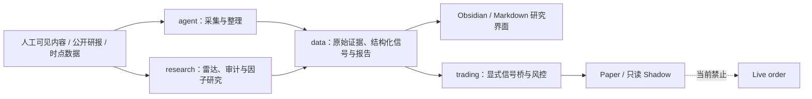

# Quant Research OS

这是一个面向个人投资研究的、可审计的中低频决策系统。项目把内容采集、宏观—行业—个股研究、券商研报审计、Paper 执行和只读券商账户观察拆成独立层，目标是形成可追溯的研究证据，而不是让模型直接控制真实资金。

> 当前结论：项目可以进行本地研究、离线复现和 Paper 验证；尚未具备自动实盘交易资格，也尚未产出可宣称真实有效的券商准确率榜或三层量化 Alpha。

## 当前能力

| 模块 | 当前状态 | 可以做什么 | 不能据此声称什么 |
|---|---|---|---|
| DeepVan 日常采集 | 可用 | 将人工可见、复制或 OCR 的内容整理为结构化信号并同步到 Obsidian | 不是站点全量数据，也不是实时行情源 |
| 行业变化雷达 R0 | `heuristic_baseline_not_alpha` | 对时点化行业特征做启发式排序和冲突提示 | 不是经样本外验证的行业 Alpha |
| 研报审计 V1 | `research_only_not_trade_eligible` | 采集、抽取、去重、到期评价、来源技能估计、三层因子研究和固定产物输出 | 官方真值、交易日历、客观因子和行业映射未完成受控准入，因此不能称为正式排名或已准入策略 |
| 小资金执行层 | `paper_only` | 验证资金、费用、整手、风险门禁、订单状态和审计链 | 不会也不允许提交真实订单 |
| 华泰 MQuant | 只读 Shadow，当前阻塞 | 在官方客户端获权后导出本地只读账户快照并做健康检查 | 目前不能声称已连接真实账户；快照哈希也不是券商来源认证 |

## 系统边界



系统遵守三条底线：

1. 先保存证据和可用时间，再计算观点与收益，避免未来数据泄漏。
2. “基本面预测正确”和“市场交易有效”分开评价，综合因子不得反向修改原始审计结果。
3. 所有不完整、未认证或低置信输入默认拒绝进入正式结论，不能用平均分掩盖宏观、行业和个股之间的冲突。

## 目录导航

```text
quant/
├─ agent/                         # 本地内容采集、日常流水线和 Obsidian 写入
├─ research/                      # 行业雷达、研报审计、来源技能与因子研究
│  └─ broker_report_audit/        # 宏观—行业—个股研报审计 V1
├─ trading/                       # Paper 执行、风险门禁和只读券商桥
│  └─ brokers/                    # 券商边界适配器，不含实盘写入能力
├─ integrations/                  # 必须在外部官方运行环境中使用的脚本
│  └─ htsc_mquant/                # 华泰 MQuant 只读快照导出器
├─ configs/                       # 版本化研究与执行策略配置，不存秘密
├─ schemas/                       # 外部交换数据契约
├─ data/                          # 样例、私有输入、缓存和生成结果
├─ docs/                          # 规格、实施计划、架构和接入记录
├─ tests/                         # 单元、管道、时点和对抗性测试
├─ skills/                        # 可复用的本地 Agent 技能
└─ obsidian-vault/                # 人工阅读与复盘界面
```

更详细的依赖方向和数据生命周期见 [架构说明](docs/ARCHITECTURE.md)。各目录的输入、输出和禁区由各自 README 定义：

- [采集层](agent/README.md)
- [研究层](research/README.md)
- [数据目录](data/README.md)
- [配置目录](configs/README.md)
- [外部集成](integrations/README.md)
- [Schema 目录](schemas/README.md)
- [测试目录](tests/README.md)
- [交易执行层](trading/README.md)
- [项目文档](docs/README.md)

## 快速开始

当前快照已在 Python 3.12 验证，并应始终从项目根目录执行命令。主体代码只依赖 Python 标准库；PDF 本地文本抽取可选用 `pypdf`。以下命令假设 `python` 已加入 PATH；若未加入，请在 IDE 中选择解释器，或将 `python` 替换为本机解释器的绝对路径。

### 1. 运行全部测试

```powershell
python -m unittest discover -s tests -v
```

### 2. 将可见文本整理成研究信号

```powershell
python -m agent.deepvan_daily_pipeline `
  --visible-text data/inbox/deepvan_visible_text.sample.txt `
  --captured-at 2026-07-03T09:30:00+08:00
```

输入必须是你有权读取且当时真实可见的内容。流水线不会绕过登录、权限或网站访问限制。

### 3. 生成行业雷达样例

```powershell
python -m research.industry_radar `
  --input data/industry/industry_radar.sample.json `
  --output data/reports/industry/local-run.md `
  --json-output data/reports/industry/local-run.json `
  --config configs/industry_radar.r0.json
```

### 4. 运行研报审计

```powershell
python -m research.broker_report_audit audit `
  --dimensions macro,industry,stock `
  --as-of 2026-08-04

python -m research.broker_report_audit audit `
  --dimensions macro,industry,stock `
  --as-of 2026-08-04 `
  --offline

python -m research.broker_report_audit build-factor --as-of 2026-08-04
python -m research.broker_report_audit deep-read --as-of 2026-08-04 --limit 20
```

默认配置位于 [broker_report_audit.v1.json](configs/broker_report_audit.v1.json)。固定输出包括三张独立准确率表、来源技能立方体、三层因子、滚动样本外报告、仪表盘、深读清单、覆盖率、异常表和运行清单。只应信任标准 CLI 产生并通过验证的产物；直接写 SQLite 或自行构造 Python 对象属于诊断路径。

在线 `audit` 访问的是东方财富公开可抓取样本，不代表券商全部研报；未抓到不等于未发布。当前人工验证 manifest 尚未完成，受控官方真值适配器也尚未接齐，因此空准确率表、异常记录和 `not_admitted` manifest 都可能是正确的 fail-closed 结果。包内数据流和逐项产物见 [研报审计包说明](research/broker_report_audit/README.md)。

### 5. 运行 1 万元 Paper 验证

```powershell
python -m trading.paper_run
```

该命令使用合成数据验证执行内核，不是收益回测，也不是投资建议。

### 6. 检查华泰只读 Shadow 状态

```powershell
python -m trading.huatai_shadow_probe `
  --config configs/htsc_mquant_shadow.example.json
```

在正式客户端授权、契约校准和人工核对完成前，预期结果应为 `blocked`。具体步骤见 [华泰 MQuant 只读导出器说明](integrations/htsc_mquant/README.md)。

### 7. 生成本地三层观察仪表盘

首次建立可比基线：

```powershell
python -m agent.market_observation_pipeline `
  --input data/inbox/market_observation/2026-08-05-close.draft.json `
  --first-baseline
```

后续观察必须显式传入上一期密封观察及其 manifest，不能自动把 `latest` 当作真源：

```powershell
python -m agent.market_observation_pipeline `
  --input data/inbox/market_observation/2026-08-06-close.draft.json `
  --previous data/signals/cn-market-2026-08-05-close.sealed.json `
  --previous-manifest data/actions/cn-market-2026-08-05-close.manifest.json
```

标准 CLI 会按 `observation_id` 生成不可变的密封 JSON、manifest 和历史 HTML，同时写入真实 `sealed_at`，并通过 `latest.alias.json` 校验上一期链和决策时点后才更新 `latest.html`。旧观察不能把最新页回退，同一时点不同观察也不能覆盖。页面集中展示宏观状态、行业20/60日相对表现、跨行业个股验证样本、三层冲突、失效条件、数据质量和较上一期的状态变化。非空 `trade_action`、未来或同日仅日期证据、未知 Schema、重复 ID、伪造比较字段或不匹配 manifest 都会失败关闭。CLI 与 SHA-256 只证明文件契约和内容一致性，不证明上游来源已获正式准入；当前仍是 `diagnostic_only_not_admitted`，不产生订单。

## 数据与隐私

- `*.sample.*` 是可提交的脱敏样例；账户持仓、券商快照、抓取正文、缓存、SQLite 和运行报告默认视为本地数据。
- `.gitignore` 只保护尚未被 Git 跟踪的文件。已经进入版本历史的敏感信息必须另行清理，不能依赖新增忽略规则。
- 不提交密码、验证码、资金账号、股东账号、身份证号、手机号、Token、Cookie 或 `account_binding_secret`。
- 原始证据应尽量不可变；规范化、特征、结论和展示文件分层生成，并保留来源、可用时间、版本和哈希。

## 开发规则

所有参与本项目的人和 Agent 都必须遵守 [AGENTS.md](AGENTS.md)。它是本项目唯一的协作规则源，核心要求是第一性原理、时点正确、默认拒绝、最小可逆改动和对抗式审查。

本项目仅用于个人研究，不构成投资建议。任何进入模拟交易的信号都必须先通过预注册的样本外门禁；当前项目不支持自动实盘下单。
