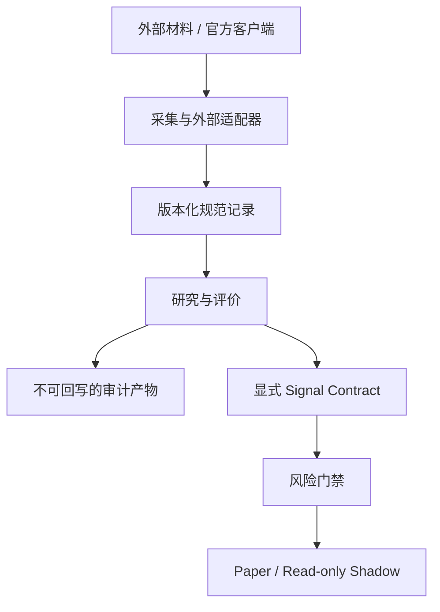

# 项目架构与数据契约

## 1. 架构目标

本项目不是一个“预测分数直接下单”的脚本，而是一条证据驱动的研究链：每个结论都应能回到当时可见的原始材料、规范化字段、模型版本和评价真值。系统优先保护时点正确性、可复现性和真实资金边界。

## 2. 五层结构

| 层 | 目录 | 核心职责 | 输出边界 |
|---|---|---|---|
| 采集层 | `agent/`、`integrations/` | 获取有权访问的可见内容或官方客户端只读数据，并规范化 | 带来源、时间和版本的结构化记录 |
| 研究层 | `research/` | 行业变化、研报 claim、真值评价、技能估计和因子研究 | 审计表、诊断因子、报告和异常 |
| 证据层 | `data/` | 保存原始证据、缓存、结构化信号和生成结果 | 可复现输入与产物，不含业务逻辑 |
| 展示层 | `obsidian-vault/`、`docs/` | 人工阅读、复盘、规格和架构说明 | Markdown 与人工确认记录 |
| 执行层 | `trading/` | 显式接收准入信号，完成风控、Paper 账本和只读 Shadow | Paper 订单或阻塞原因；当前无 Live 输出 |

## 3. 允许的依赖方向



关键约束：

- 外部 SDK 对象、网页响应和 PDF 不能直接进入交易层，必须先转换成版本化规范记录。
- `research/` 不得依赖券商写接口；`trading/` 不解析原始研报或自然语言。
- 展示文件只读取消费研究结果，不能成为原始审计表或技能值的真源。
- 券商完整账户与策略账本分离。只有显式划入且具有持久化成交来源链的资产才属于策略。

## 4. 数据生命周期

```text
raw evidence
  -> normalized record
  -> ResearchClaim / point-in-time feature
  -> mature ClaimOutcome / label
  -> SkillSnapshot / FactorObservation
  -> walk-forward evaluation
  -> diagnostic report
  -> admission gate
  -> paper research
```

每一级都应保留上一级的标识和版本，不能用后生成的数据覆盖早期状态。推荐的最小追踪字段是：

```text
record_id
source
source_entity
subject_id
observed_at
available_at
schema_version
producer_version
content_sha256
parent_record_ids
```

其中 `available_at` 决定信息何时能参与模型；`observed_at` 只说明系统何时看到它，两者不能混用。

## 5. 产物分区

| 类别 | 建议位置 | 是否适合提交 |
|---|---|---|
| 脱敏、稳定样例 | `data/**/**.sample.*` | 是 |
| 原始私有输入 | `data/raw/`、`data/inbox/` | 默认否 |
| 内容寻址缓存 | `data/cache/` | 否，可重建 |
| 研究数据库 | `data/research_reports/` | 默认否 |
| 固定研究报告 | `data/reports/<module>/` | 视是否脱敏决定 |
| 临时测试输出 | `data/tmp/`、`.tmp/` | 否，可删除 |
| 券商只读快照 | `data/broker/` | 否 |
| Paper 运行账本 | `data/trading/` | 默认否 |

`.gitignore` 负责阻止新的本地产物误提交，但不会处理已被 Git 跟踪的文件。清理历史必须单独审查。

## 6. 研究状态机

```text
diagnostic
  -> extraction_validated
  -> truth_and_pit_validated
  -> walk_forward_admitted
  -> paper
  -> authenticated_shadow
  -> live (当前不支持)
```

状态只能在对应证据完整后前进：

- `extraction_validated`：三个维度各至少抽查 30 份，元数据一致且字段精确率达到 95%。
- `truth_and_pit_validated`：官方首次发布真值、交易日历、行情和行业映射由受控适配器产生并可回溯。
- `walk_forward_admitted`：M1 按预注册窗口和成本假设稳定优于 B0/B1/B2，且不由单一行业贡献。
- `paper`：只允许模拟研究，不代表能实盘。
- `authenticated_shadow`：券商只读数据的账户绑定、时效、完整性、SDK 契约和人工核对均通过。
- `live`：仓库当前没有实现，也不得通过配置直接解锁。

## 7. 为什么暂不移动现有模块

`research/broker_report_audit/cli.py`、`factors.py` 和 `storage.py` 目前体积较大，但测试、抽取器源码哈希和验证 manifest 与现有路径及实现绑定。直接按审美拆文件会改变可复现证据并扩大回归面。

本轮采用“补 README、目录契约和忽略边界”的方式完善架构，不移动稳定模块。未来若拆分，先完成：

1. 公共 API 与内部 API 清单；
2. Schema 与数据库迁移方案；
3. 源码哈希和 manifest 版本升级；
4. 旧缓存失效策略；
5. 全套对抗性测试和离线确定性复验。

## 8. 当前优先级

架构上最重要的下一步不是继续拆目录，而是补齐受控数据适配器：官方首次发布真值、正式交易日历、客观市场因子和时点行业映射。它们完成前，研报框架的安全状态应继续是 fail-closed。
