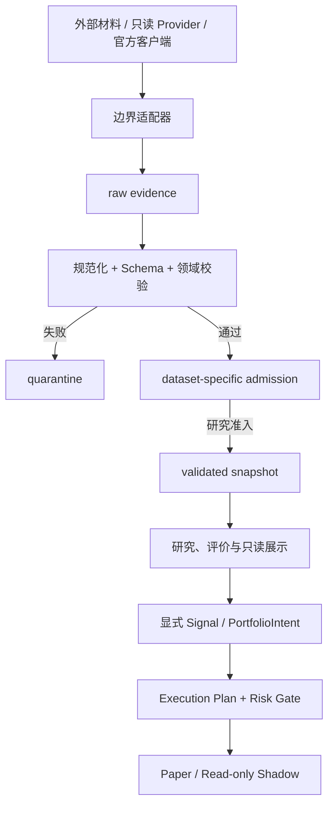

# 项目架构与数据契约

## 1. 架构目标

本项目是一条证据驱动的研究链，不是“分数直接下单”的脚本。每个结论都应能回到决策时点前可用的原始材料、真实上游、规范字段、生产器版本和评价真值。

系统优先保护五件事：时点正确、来源可追溯、失败关闭、离线可复现和真实资金隔离。复杂度不能代替证据。

## 2. 分层职责

| 层 | 目录 | 核心职责 | 明确禁区 |
|---|---|---|---|
| 采集与编排 | `agent/`、`integrations/` | 获取有权访问的可见内容，调用只读探针或官方客户端边界脚本 | 不承载因子准入或交易决策 |
| 市场数据边界 | `research/market_data/` | Provider Registry、统一契约、规范化、领域校验、本地准入和证据存储 | 不以 Provider 名称自证真值，不拼接半批 |
| 研究与评价 | `research/` | Factor Lab、行业雷达、研报 claim、真值评价、来源技能和因子研究 | 不调用券商写接口，不读取 quarantine |
| 证据与产物 | `data/` | 原始证据、规范记录、缓存、报告和 manifest | 不保存业务逻辑，不让展示层回写原始记录 |
| 展示 | `obsidian-vault/`、Dashboard、`docs/` | 人工阅读、复盘、规格和状态说明 | 不成为审计真源或交易入口 |
| 执行边界 | `trading/` | 显式信号桥、风险门禁、Paper 账本和只读 Shadow | 永久不支持 LIVE 下单、撤单或自动授权 |

## 3. 允许的依赖方向



关键约束：

- 外部 SDK 对象、网页响应和 PDF 必须先转成版本化记录，不能渗透到研究或交易领域模型。
- 市场数据消费者只读取 `validated/`；quarantine 只用于诊断。
- 报告来源、市场数据 Provider、真实上游和真值来源分别记录，不能用一个 `source` 字段混为一谈。
- `research/` 不依赖券商写接口；`trading/` 不解析原始研报、Markdown 或行业榜。
- 券商完整账户与策略账本分离，未显式划入的长期持仓不得被策略认领。

自适应仓位V2在兼容V1裸权重入口之外新增 `PortfolioIntent`：普通空目标失败关闭，只有明确现金/退出意图可表达0%目标。计划器从意图和账户状态推导订单风险方向，使用稳定 `intent_id` 与逐日 `attempt_id` 区分同次重放和跨日退出重试；调用方不能仅靠自报枚举绕过普通换手。独立日频Paper账本从前态、证据绑定成交和收盘估值重算账户，不反向授权风险门或券商边界。

## 4. 市场数据生命周期

```text
MarketDataRequest
  -> ProviderPayload(raw_content, records, upstream_source)
  -> deterministic normalization
  -> Schema validation
  -> domain validation
  -> local admission
  -> MarketDataBatch
  -> raw + validated storage

provider/query/validation failure
  -> structured ProviderError
  -> raw + quarantine
  -> no research record
```

缓存键至少绑定：

```text
provider_id
dataset_type
request_fingerprint
adapter_version
schema_version
```

Primary 失败后的 fallback 必须整批重取。Secondary 不得填补 Primary 缺行，所有来源失败时只返回结构化失败，不生成默认或合成数据。

详细 Provider、数据集和探针说明见 [市场数据 V2](MARKET_DATA.md)。

## 5. 时点与来源

推荐的通用追踪字段是：

```text
record_id / batch_id
provider_id / upstream_source
subject_id
observed_at / requested_at / fetched_at / available_at
schema_version / adapter_version / producer_version
raw_content_sha256 / normalized_content_sha256
parent_record_ids
```

`available_at` 决定信息何时可进入决策，`fetched_at` 只说明本次抓取时间。当前重新抓取历史数据必须标为 `historical_backfill`，不能冒充当时已保存的捕获；离线回放也必须保留原批次的证据链。

宏观数据使用首次公布值，财报使用首次披露值。缺少可靠披露时间的财务数据保持 `research_only_not_pit`；当前行业分类保持 `diagnostic_current_only`；工作日近似不能冒充交易日历。

SHA-256 证明内容一致性，不证明文件来自官方机构。SDK 成功、Provider 名称和调用方布尔认证同样不能代替来源认证。

## 6. 统一批次与 Schema

`MarketDataBatch` 是 Provider 与研究消费者之间的版本化信封，分别保存原始内容和规范内容 SHA-256。数据集记录使用独立 Schema：日线、交易日历和证券基础信息不能靠一个松散对象混用。

Schema 只验证结构；Python 代码负责证券一致性、日期窗口、唯一性、顺序、OHLC、非负数量和 dataset-specific admission。修改字段类型或语义时必须升级版本并明确拒绝或迁移旧版本。

任何消费 MarketDataBatch 的正式产物都应在 manifest 中绑定 `batch_id`、真实上游、请求指纹、raw/normalized hash、记录数、最大可用时间、准入状态和问题列表。工作区不干净时还应记录 `git_diff_sha256`；仅记录 commit 不能声称完全可复现。

## 7. 产物分区

| 类别 | 位置 | 读取边界 |
|---|---|---|
| 市场数据原始响应 | `data/market_data/raw/` | 证据与诊断 |
| 市场数据隔离区 | `data/market_data/quarantine/` | 仅诊断，研究层禁止读取 |
| 市场数据合格批次 | `data/market_data/validated/` | 仍需检查 `admission_status` 与 `synthetic=false` |
| 脱敏稳定样例 | `data/**/**.sample.*` | 可提交 |
| 原始私有输入 | `data/raw/`、`data/inbox/` | 默认不提交 |
| 研报数据库与缓存 | `data/research_reports/`、`data/cache/` | 本地生成，可重建或回放 |
| 券商只读快照 | `data/broker/` | 只读 Shadow，默认不提交 |
| Paper 账本 | `data/trading/` | 默认不提交 |

历史密封 observation、manifest 和 Dashboard 不因新 Schema 被改写。新版本通过双读或显式拒绝保持兼容边界。

## 8. 研究状态

研究能力按证据逐级判断，但不会通向 LIVE：

```text
diagnostic
  -> extraction_validated
  -> truth_and_pit_validated
  -> walk_forward_admitted
  -> paper

外部账户只读分支：blocked -> authenticated_read_only_shadow
```

- `extraction_validated`：抽取规则达到预注册的人工抽查门槛。
- `truth_and_pit_validated`：真值、交易日历、行情和行业映射具备受控时点证据。
- `walk_forward_admitted`：按预注册窗口、基准、成本和集中度检查通过。
- `paper`：只允许模拟研究，不代表真实收益或实盘安全。
- `authenticated_read_only_shadow`：只代表受控只读账户观察，不产生订单权限。

LIVE 是永久不支持的终止错误，不是状态机下一阶段。所有入口统一拒绝为 `live_not_supported`。

## 9. 稳定模块与修改边界

`research/broker_report_audit/cli.py`、`factors.py` 和 `storage.py` 与历史缓存、源码哈希及大量测试绑定。市场数据 V2 通过新增适配器和 Registry 接入，不为审美目的移动或拆分稳定模块。

`research/factor_lab/` 是新增的隔离研究域：证据 Provider 只输出规范化契约，插件只计算冻结因子，Runner 只做预注册 Screen/Confirm/Weekly/Verify。行业雷达和主观卡片不能成为标签，Factor Lab 不能导入 `trading`，任何产物都不能直接形成订单。

破坏性变更必须同时处理 Schema、配置、缓存失效、manifest、README、旧版本策略和对抗性测试。实现完成、测试通过、真实接口连通、研究准入和允许模拟是不同状态，交付时必须分开报告。
